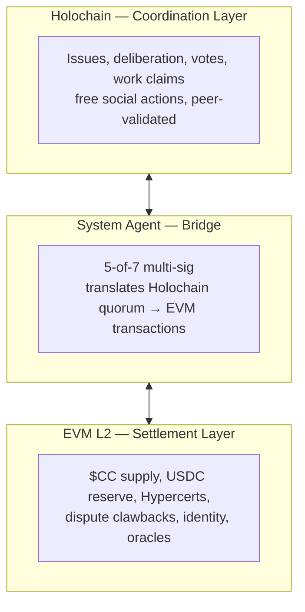
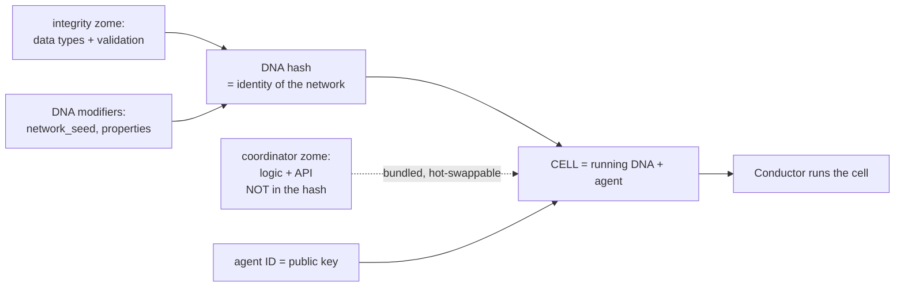
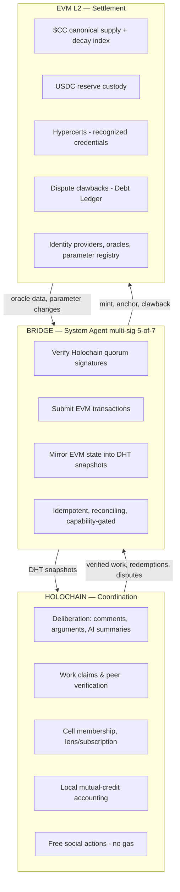
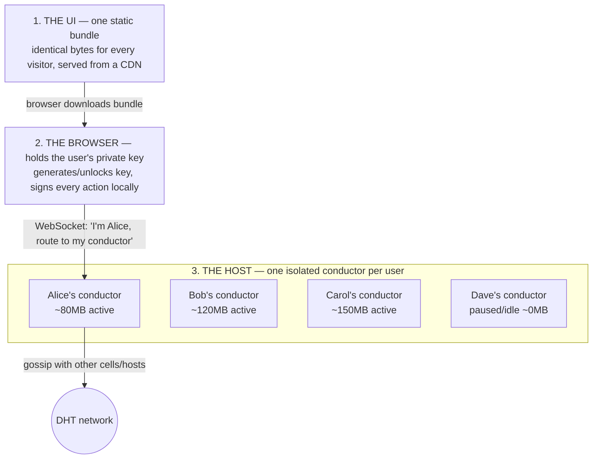

# Holochain + Kindact — A Plain-Language Architecture Guide

> **Purpose**: Explain the core elements of Holochain and how Kindact might be structured on top of it, for readers who aren't Holochain experts. Consolidated from architecture discussions and grounded in the actual specs and prototype under [`holochain/`](.).
>
> **Status**: Explanatory. This is a learning/onboarding document, not a spec. The authoritative design lives in [`specs/`](specs/) and the [exploration doc](../implementation/holochain-architecture-exploration.md). Per [AGENTS.md](AGENTS.md), the substrate decision is being finalized — read this to *understand* the architecture, not as a commitment to build it verbatim.

---

## Table of contents

1. [The 30-second mental model](#1-the-30-second-mental-model)
2. [Core Holochain vocabulary](#2-core-holochain-vocabulary)
3. [How data lives: source chains, DHT, storage arcs](#3-how-data-lives-source-chains-dht-storage-arcs)
4. [How Kindact is structured: the three-tier "lens" model](#4-how-kindact-is-structured-the-three-tier-lens-model)
5. [What "cloning the Base DNA" actually means](#5-what-cloning-the-base-dna-actually-means)
6. [The three-layer hybrid (EVM + Bridge + Holochain)](#6-the-three-layer-hybrid-evm--bridge--holochain)
7. [How users access the app: runtime modes & the web UI](#7-how-users-access-the-app-runtime-modes--the-web-ui)
8. [Scaling, hosting & the decentralization trajectory](#8-scaling-hosting--the-decentralization-trajectory)
9. [How updates work: three surfaces, three costs](#9-how-updates-work-three-surfaces-three-costs)
10. [Key trade-offs at a glance](#10-key-trade-offs-at-a-glance)
11. [Glossary](#11-glossary)

---

## 1. The 30-second mental model

Holochain is **agent-centric** rather than **data-centric**. There's no single shared database and no central server. Instead:

- Every user is an **agent** with a cryptographic key.
- Each agent keeps their own tamper-proof history (a **source chain**).
- Groups of agents form **cells** — small peer-to-peer networks that share and validate each other's data.
- Data is spread across all members of a cell (a **DHT**), not stored in one place.

Kindact layers a structure on top of this:

- **Anchors** = free, no-code tags for discovery (`#wind-power`, `#berlin`).
- **Cells** = configured clones of one shared codebase ("Base DNA"); no coding to create.
- **Custom zomes** = the rare cases that genuinely need new code.

And because some things (real money, recognized credentials, global finality) genuinely need a blockchain, Kindact is a **hybrid**: Holochain for coordination + an EVM L2 for settlement + a **bridge** connecting them.



---

## 2. Core Holochain vocabulary

These terms unlock everything else. They are easy to confuse, so here they are concretely (using the official Holochain definitions), with examples from the actual prototype in [`kindact-hc/`](kindact-hc/).

| Term | What it actually is | Analogy | In the prototype |
|---|---|---|---|
| **Zome** | A WASM-compiled Rust code module (short for "chromosome"). Comes in two kinds (see below). **Code.** | A "module" | `wind_turbine_integrity.wasm`, `registry_integrity.wasm` |
| **Integrity zome** | Defines **data types + validation rules** (the schema). Contributes to the DNA hash. | A "database schema + rules" | `*_integrity` zomes |
| **Coordinator zome** | Defines **application logic + the public API** (functions clients call). Does **not** affect the DNA hash; can be hot-swapped on a running cell. | "The app's API/business logic" | (target design) |
| **DNA** | A bundle of zomes + a manifest (`dna.yaml`) + **DNA modifiers**. Defines the rules of a single peer-to-peer network. | A "microservice / network ruleset" | [`manhattan_windturbine.dna`](kindact-hc/dnas/manhattan_windturbine/) and the three `dna.yaml` files |
| **DNA modifiers** | The bits hashed into the DNA hash: **integrity zomes + `network_seed` + `properties` + origin/quantum time**. Coordinator zomes are *not* included. | "The fingerprint inputs" | `properties: null`, `network_seed: null` slots in `dna.yaml` |
| **DNA hash** | The cryptographic hash of the integrity zomes + DNA modifiers. It is the **unique ID of a network**. Different modifiers → different hash → **different network**. | "The network's identity" | Computed at install time |
| **Cell** | A *running instance* of a DNA bound to one agent: `DNA + agent ID = cell`. The thing that actually has a source chain, a DHT, and members. | A "live, joined network" | The Manhattan WindTurbine cell Alice runs |
| **Conductor** | Holochain's runtime ("application server") on a device. Runs an agent's cells, manages keys, sandboxes code, and does gossip/validation. | A "personal app runtime" | One per Electron window in `hc-spin` |
| **hApp** | A whole Holochain application: one or more DNAs (each filling a named **role**) + an optional UI. | "The app you install" | The Kindact hApp |

Two more that matter for hosting:

| Term | What it is |
|---|---|
| **Host** | A machine that runs conductors *on behalf of* users (Holo Network or Kindact-operated). A host doesn't "host a cell" — it hosts *users*, each of whom participates in their own cells. (This is a [Holo.host](https://holo.host) concept layered on top of core Holochain.) |
| **Agent / Agent ID** | One identity = one keypair. The **agent ID** *is* the public key. It signs everything you author, proving authorship and preventing tampering. |

> **The single most important clarification**: a *cell is not a file*. It's the live peer-to-peer network that emerges when one or more agents install the same DNA. Because the DNA hash is built only from **integrity zomes + modifiers**, changing those creates a *different* network that can't see the old one's data — but changing a **coordinator zome** does *not* (you can fix logic/API bugs in place). This distinction drives the whole update story in §9.



---

## 3. How data lives: source chains, DHT, storage arcs

There is no central database. Data lives in two complementary structures.

> **Terminology note**: in Holochain, the unit written to a source chain is technically a **Record** = an **Action** (the signed act of writing) + an optional **Entry** (the data). Casual usage — and this doc — often just says "entry." When precision matters, "action" is the signed event and "entry" is the payload.

### Your source chain (your own history)

Every record you author is appended to *your* personal, append-only, hash-linked **source chain** — signed by your agent key. It's yours, it's tamper-evident, and it travels with you between devices and hosts.

### The DHT (the cell's shared, distributed memory)

When you publish a record, it also gets stored in the cell's **DHT** (Distributed Hash Table). Crucially:

- **Each agent holds only a *subset* of the cell's data — not the whole thing.**
- Each entry has a **basis address** (its hash); it's stored by the agents whose agent IDs sit "near" that address in the address space.
- Each agent advertises a **storage arc** — the slice of the address space it claims responsibility for holding and validating. (Informally you can think of an agent's slice as its "shard," but the official term is *storage arc*.)

```diagram
Cell "Housing" address space (a ring from 0 … 2³², wrapping around):

Agent A's arc ─────╮         ╭───── Agent C's arc
   (holds ~10%)    │  cell   │       (holds ~10%)
                   ▼  data   ▼
              ╭─────────────────╮
              │ ░░░░░░░░░░░░░░░ │  ← every dot = one entry
              │ ░░░░░░░░░░░░░░░ │
              ╰─────────────────╯
                   ▲         ▲
   Agent B's arc ──╯         ╰── Agent D's arc
      (holds ~10%)               (holds ~10%)
```

**Why only a subset?** If every agent held everything, every device would have to store and validate every comment/vote/issue ever posted in every joined cell — unworkable. The DHT spreads the load: many small holders, each entry replicated across enough of them for safety.

**What happens when you open something you don't hold?** Your conductor finds the authorities responsible for that basis address, fetches the data, verifies the signature, and shows it. **You see all data; you only store a slice.**

**Storage-arc auto-tuning**: as a cell grows, each agent's arc automatically shrinks to keep the redundancy (resilience) factor roughly constant. A 50-member cell → each agent holds a large arc (~50%). A 5,000-member cell → each agent holds a small arc (~1%). The math self-tunes.

> **The duplication caveat** (important for hosting cost): if many members of the same cell are co-located on one host machine, each runs a *separate* conductor with its *own* copy of its storage arc. There is **no cross-conductor deduplication on a host today**. 50 co-located members holding the same entry = 50 physical copies on that machine. This is why a single mega-host is inefficient, and why the redundancy guarantee only really holds when agents are *independently distributed* (see §8).

---

## 4. How Kindact is structured: the three-tier "lens" model

A natural worry: *"Does every new 'lens' (a city, a topic, an interest group) require writing code? Because that would never scale — there could be millions."*

**Answer: no.** Kindact's [cell architecture](specs/030-cell-architecture-and-registry/README.md) has three tiers with very different cost profiles. 99% of "I want a lens for X" never touches code.

```diagram
╭─────────────────────────────────────────────────────────────╮
│ Millions of users / cities / interests                      │
│   ├─ Anchors (pure data) ─────── unlimited, free, no-code   │
│   ├─ Cells (Base DNA + config) ─ unlimited, no-code         │
│   └─ Custom zomes ────────────── rare, curated, code        │
╰─────────────────────────────────────────────────────────────╯
```

### Tier 1 — Anchors: free, no code, scales to millions

Per [042-anchor-and-subscription-model](specs/042-anchor-and-subscription-model/README.md), an **anchor** is just a tag/path in the Global Registry (`#new-york`, `#wind-power`, `#permaculture`). Users create and subscribe to anchors with no code, no DNA, no governance. "One anchor per city" is pure data — like creating a hashtag.

**The key UX win**: you can subscribe to `#berlin-housing` and *see* relevant issues **without joining** the underlying cells. You only join a cell when you want to actively *contribute* to one of its issues. This keeps a broadly-interested user from drowning in conductor load.

### Tier 2 — Cells: cloning, not coding

Per [030](specs/030-cell-architecture-and-registry/README.md), anyone humanity-verified can create a cell by **cloning the Base DNA + filling in a config record** (see §5). No Rust, no build pipeline — the user picks options in a UI and the conductor produces a new cell. "Manhattan Wind Turbine Q3 2026" is a *user-created cell*, not a developer artifact.

The Global Registry organizes cells into three tiers:

| Tier | Examples | Who creates | Curation |
|---|---|---|---|
| **Global Registry "We"** | Single canonical instance | Genesis | Meta-governance |
| **Promoted public cells** | Berlin, Housing, Green-Energy | Meta-governance proposal | Curated |
| **User-created cells** | "Manhattan Wind Turbine", working groups | Anyone humanity-verified | Uncurated namespace |

### Tier 3 — Custom zomes: the only path that needs code

Per [041 §"Layered cell DNA"](specs/041-base-dna-specification/README.md), genuinely novel logic needs code:

- A new **decision engine** (e.g., a novel quadratic-funding variant)
- A new **metrics pack** with custom validation
- **Stricter verification logic** beyond what Base parameters can express

These are equivalent to "writing a new app feature." Meta-governance curates them into reusable zome libraries other cells can install. Rare by design.

> **The real open question** isn't *whether* cells need code — it's whether the Base DNA's **configuration knobs are rich enough** to cover most cases without forcing custom zomes. If the parameterization surface is too narrow, people will end up needing code for things that should have been pure config — *that* would be the actual scaling blocker. (Flagged in [030's](specs/030-cell-architecture-and-registry/README.md) and [041's](specs/041-base-dna-specification/README.md) open questions.)

---

## 5. What "cloning the Base DNA" actually means

This is the mechanism that makes no-code cell creation possible.

### The target design (per spec 041)

There is **one canonical "Base DNA"** build artifact — a fixed set of generic zomes (issues, comments, lifecycle, identity, dispute, etc.). "Cloning" is in fact a **first-class Holochain runtime operation** (`create_clone_cell` in the HDK / `createCloneCell` in the JS client): you take an existing DNA and change one or more **DNA modifiers** to get a new DNA hash and therefore a new, isolated network — *without writing or compiling any new code*. To create a new Kindact cell, a user does **not** recompile anything. Instead:

1. Start from the same `kindact_base.dna` (unchanged integrity zomes / bytecode).
2. Set the **DNA `properties`** modifier — arbitrary application config (written as YAML), readable by the zomes at runtime:

```yaml
properties:
  cellName: "berlin"
  scopeLevel: "city"
  locationRefs: ["h3:88283082..."]
  membrane: { read: "public", write: "scope_verified" }
  decisionEngine: "approval_voting"
  jurisdictionalClaims: ["jc:berlin-housing-rules-v2"]
```

3. Optionally also set a random **`network_seed`** modifier (so the new cell is a fresh, empty network rather than colliding with anyone who happened to pick the same properties).
4. The conductor hashes `(integrity zomes + DNA modifiers)` → a **new DNA hash** → a **new isolated network/DHT**.
5. The Base integrity zomes read the properties at runtime (via the `dna_properties` macro / `try_from_dna_properties`) and enforce the configured rules in their validation callbacks.

That's "cloning": **same integrity code, different modifiers, different hash, different cell.** No Rust compilation, no new files. The "config record" registered in the Global Registry is essentially that properties blob plus the resulting DNA hash, so others can specify the *same* modifiers and join the *same* clone network.

> **Important constraint**: DNA `properties` are a *modifier*, so they can only be set **at install or clone time — not changed on a running cell**. Truly *runtime-tunable* values (e.g. a verification threshold you want to change later by governance vote) must therefore live as **data entries** read at validation time (Kindact's Parameter Registry, spec 013), **not** as DNA properties. Changing a property = forking to a new network. See §9.

### Why is the Global Registry a *separate* DNA?

Because it plays a fundamentally different role — it's the cross-cell discovery index (anchors, cell directory, bridge signers, jurisdictional claims). Different entry types, different membrane (write-via-meta-governance), different scaling profile (one canonical instance everyone subscribes to). **It will always be its own DNA.**

### Prototype today vs. target architecture

The current prototype in [`kindact-hc/`](kindact-hc/) has **three hand-built DNAs** (`global_registry`, `housing`, `manhattan_windturbine`), each with its own integrity zome. This is a **prototyping shortcut** to see two cells gossip in isolation — *not* the target design.

```diagram
PROTOTYPE TODAY                          TARGET (per spec 041)
─────────────────                        ─────────────────────
crates/kindact_base/  (shared types)     crates/kindact_base_*/  (six zome libs)
                                                 │
dnas/                                            │ built once into:
├── global_registry/   ← own zomes               ▼
├── housing/           ← own zomes        kindact_base.dna   (canonical artifact,
└── manhattan_         ← own zomes                            registered hash)
    windturbine/                                  │
                                                  │ instantiated as cells
Three separate DNA hashes,                        │ via different properties:
three networks,                                   ▼
hand-built validation each.              ┌──────────────────────────┐
                                         │ cell "berlin"   props:{} │
                                         │ cell "housing"  props:{} │
                                         │ cell "manhattan-wt" "..."│
                                         │ cell "your-block" "..."  │
                                         │  ... millions ...        │
                                         └──────────────────────────┘
                                                  +
                                         global_registry.dna
                                         (one separate DNA, always)
```

- **`global_registry`** → stays its own DNA forever (different role).
- **`housing` + `manhattan_windturbine`** → in the target design these collapse into `kindact_base.dna` + different `properties`. They're separate today only because the parameterized Base isn't implemented yet.

A reasonable next prototype step: merge `housing` and `manhattan_windturbine` into a single `kindact_base.dna` and spawn both as instances with different properties — proving the "no-code cell creation" claim concretely.

---

## 6. The three-layer hybrid (EVM + Bridge + Holochain)

Holochain is great for coordination, but some things genuinely need a blockchain's global, atomic, externally-recognized state. The [ADR (spec 000)](specs/000-substrate-architecture-decision-record/README.md) splits responsibilities across three layers.



### What lives where, and why

| Stays on **EVM** (needs global atomic state / ecosystem) | Moves to **Holochain** (agent-centric, peer-validated, free) |
|---|---|
| USDC reserve custody | Deliberation (comments, arguments, summaries) |
| $CC canonical supply + global decay | Work claims & verification entries |
| Hypercerts (recognized impact credentials) | Cell/lens membership & subscription |
| Confidence curve & redemption caps | Local mutual-credit accounting |
| Dispute clawbacks (global finality) | Free social actions |
| Identity providers (Gitcoin, World ID, …) | |
| Oracle integrations (Chainlink, Pyth, …) | |

### The bridge is the load-bearing risk

Cross-chain bridges are historically the most-attacked surface in crypto (Wormhole, Ronin, Nomad, Multichain). Per [spec 040](specs/040-bridge-specification/README.md), the design defends with: a 5-of-7 multi-sig, idempotent operations (no replay), explicit `pending → complete / rolled_back` reconciliation (no cross-chain atomicity is assumed), capability-token gating on the Holochain side, and mandatory external audit + bug bounty before any real deployment.

> **Note**: if Kindact ever drops fiat-redemption and goes "closed-loop" (internal accounting only, like LETS points), most of the EVM layer and the bridge become unnecessary, and a pure-Holochain variant would be drafted instead. The current design assumes **fiat-bridged**.

---

## 7. How users access the app: runtime modes & the web UI

A Holochain app needs a **conductor** running *somewhere*. Who runs it determines the trade-off. Per [spec 047](specs/047-holo-hosting-strategy/README.md), there are three runtime modes:

| Mode | Where the conductor runs | What the user sees | Trade-off |
|---|---|---|---|
| **Local desktop** | User's laptop (Tauri/Electron app bundling the conductor) | A desktop app (like Signal Desktop) | Most decentralized; requires install |
| **Local mobile** | User's phone (native app) | A normal mobile app | Sovereign, but battery + background-kill issues |
| **Holo hosting** (or Kindact-operated pool) | A third-party host machine | A normal web page in any browser | Lowest friction; adds a hosting-trust assumption |

**Yes, a browser-only web interface is possible** — via Holo hosting or a Kindact-operated conductor pool. The web frontend is just a normal SvelteKit/React app talking over WebSocket to *some* conductor.

### How the web UI actually plumbs through to per-user conductors

The thing that trips people up: there is **one** UI bundle for everyone, and **many** tiny per-user backends.



**Key facts:**

- The UI is a **static SPA** — not personalized server-side. Customization happens at runtime in the browser by talking to *your* conductor.
- **Authentication is browser-side keypair**, not email/password. No auth provider, no session cookies on the host. (Trade-off: account recovery = your responsibility, like a crypto wallet. Multi-device needs key import or social recovery.)
- **Signing happens in the browser.** The host relays and stores data but never sees your private key — so it **cannot forge** entries as you. It *can* censor reads (withhold gossip), which is why multi-host replication matters.

### Conductor lifecycle = "scale to zero" (like serverless)

| State | Per-user RAM | When |
|---|---|---|
| **Active** (using the app) | 80–250 MB | While WebSocket open + grace period |
| **Warm** (recently used) | 10–30 MB | Minutes/hours after closing the tab |
| **Cold** (paused to disk) | ~0 MB RAM (disk only) | After idle; resumes in seconds |

**Active concurrency is the scaling variable, not registered-user count** — identical to how Discord/Slack scale. 100k registered users with 5k concurrently active ≈ 5k × 150 MB ≈ 750 GB RAM + ~10 TB cold disk. Real, but tractable, and spread across a host fleet.

> **Closest mental models**: Cloudflare Durable Objects, Fly.io scale-to-zero machines, or old-school per-session webmail processes — but each "tiny per-user object" is a real peer in a P2P network.

---

## 8. Scaling, hosting & the decentralization trajectory

### Does load stay "local" with per-community hosts?

Mostly yes — and it's emergent, not enforced. A host has no notion of "I belong to community A"; it just runs the conductors of whichever users log into it.

- If 1,000 community-A users use host A, host A becomes the de-facto cell-A hub — because those members happen to live there.
- If a community-B user logs into host A, host A *also* spins up that user's conductor, which joins cell B and gossips with cell B's network — so host A picks up a small slice of cell B's data, just for that one user.
- A user's data follows them across hosts; replication keeps things consistent.

### The duplication cost (be honest about it)

Because there's no cross-conductor dedup on a host:

| Parameter | Example |
|---|---|
| Cell "Housing" total data | ~800 MB |
| Members | 500 |
| Auto-tuned arc per agent | ~10% → ~80 MB each |
| Redundancy factor | ~50× |
| **If all 500 live on host A** | **~40 GB for Housing alone, on one machine** |

And co-location **defeats the redundancy guarantee**: the DHT thinks there are 50 independent copies, but if they share one host, one machine failure wipes them all. The fix is **distribution** — which is exactly what the long-term Holo Network (many independent hosts) provides.

### The decentralization trajectory — the real value proposition

Desktop and (partially) mobile users are **full DHT peers**, so they *add* capacity and resilience automatically:

| Peer type | Reliability | Contribution |
|---|---|---|
| **Hosted conductor** | Always-on | Carries most capacity at launch |
| **Desktop conductor** | Reliable when on | Real independent capacity + redundancy (no host duplication) |
| **Mobile conductor** | Ephemeral (OS kills background) | Helps when foregrounded; network can't depend on it |

```diagram
Year 0 — Launch                        Year 2+ — Mature
─────────────────                      ─────────────────
   ╭─────────────────╮                    ╭─────────────────╮
   │ Kindact host(s) │ ◀─ web users       │   Holo Network  │ ◀─ web users
   │ (most capacity) │                    │ (distributed)   │
   ╰─────────────────╯                    ╰─────────────────╯
            ↕ gossip                               ↕ gossip
   ╭─────────────────╮                    ╭─────────────────╮
   │ Few desktop     │                    │ Many desktop +  │
   │ power users     │                    │ self-hosters    │
   ╰─────────────────╯                    ╰─────────────────╯
            ↕                                       ↕
   ╭─────────────────╮                    ╭─────────────────╮
   │ Few mobile      │                    │ Many mobile     │
   │ (intermittent)  │                    │ (intermittent)  │
   ╰─────────────────╯                    ╰─────────────────╯
```

**Centralized-feeling at launch** (nearly all capacity on Kindact's hosts) → **naturally decentralizes** as power users adopt desktop apps and the Holo Network matures. This is the structural difference from AT Protocol, where "more users = more permanent load on the central AppView," forever.

> **Honest framing**: at launch, a Kindact-operated host pool is roughly *as centralized* as an AT-Proto AppView — the win is the *evolution path*, not the day-1 state. The day-1 cost is also higher (replication overhead + multi-host pool). You're paying real infrastructure cost now for a decentralization payoff that materializes over years.

---

## 9. How updates work: four surfaces, four costs

This is one of the genuinely awkward parts of Holochain — but **less awkward than it first appears**, because not all "code changes" are equal. The rule is: **the DNA hash is a network's identity, and only *integrity zomes + DNA modifiers* go into that hash.** Change those, and you've forked to a *parallel network* that can't see the old one's data. But **coordinator zomes** (logic + API) are *not* in the hash and can be **hot-swapped on a running cell** — so a lot of "code changes" don't fork the network at all.

The art is putting each kind of change on the right surface:

```diagram
╭───────────────────────────────────────────────────────────────╮
│ Surface 1: UI (web frontend)                                  │
│   Cost: same as any web app. Coordination: zero.              │
│   ⚡ Iterate freely — daily releases fine.                    │
├───────────────────────────────────────────────────────────────┤
│ Surface 2: Runtime data config (Parameter Registry)          │
│   Tunable values stored as DATA entries (EVM → DHT),         │
│   read by validation at runtime. NOT DNA properties.         │
│   Cost: a governance vote. Picked up within bridge SLA.      │
│   ⚙️ Use for: thresholds, durations, fees, quorum sizes,     │
│      feature flags, schedule windows.                        │
├───────────────────────────────────────────────────────────────┤
│ Surface 3: Coordinator zome (logic + API)                    │
│   Hot-swappable on a running cell — does NOT change the      │
│   DNA hash, does NOT fork the network.                       │
│   Cost: deploy new coordinator code; minor version-skew care.│
│   🔧 Use for: bug fixes, new API functions, business logic.  │
├───────────────────────────────────────────────────────────────┤
│ Surface 4: Integrity zome OR DNA modifiers                   │
│   (data types, validation rules, or any property change)     │
│   Cost: new DNA hash = new network = migration.              │
│   Coordination: cells rebuild, re-register, migration window.│
│   🐢 Use for: genuine protocol-semantic changes. Plan months.│
╰───────────────────────────────────────────────────────────────╯
```

> **Two caveats on the "easy" surfaces.** (1) Coordinator hot-swaps are per-agent — different members may run slightly different coordinator versions, so you must manage version skew (forward/backward-compatible APIs). (2) "Config" must be *data entries* (Surface 2), **not** DNA `properties` — properties are modifiers, so changing them is actually a Surface-4 fork, not a cheap config change.

### Common change scenarios

| Change | Surface | Coordination | Time | User disruption |
|---|---|---|---|---|
| UI fix / redesign / new screen | 1 — UI | None | Hours | None |
| One community's branded UI | 1 — UI | None | Days | None |
| Bug fix in business logic / new API function | 3 — Coordinator zome (hot-swap) | None (no fork) | Hours–days | None |
| Tweak a threshold (**if parameterized**) | 2 — Config data | Routine gov vote | Days | None |
| Change supported-language list | 2 — Config data | Routine gov vote | Days | None |
| One community adds custom voting (new validation) | 4 — Integrity DNA (one cell) | That cell + Registry acceptance | Weeks | One cell, one migration window |
| Replace platform-wide voting algorithm | 4 — Integrity DNA (Base, all cells) | Constitutional vote + all cells rebuild | Months | All users, multi-month migration |
| Change identity-verification rules | 4 — Integrity DNA (Base) | Constitutional vote | Months | All users |
| Tweak a threshold (**if baked into DNA properties**) | 4 — DNA modifier fork | Constitutional vote | Months | All users — **avoid this!** |

### The make-or-break design discipline

> Anything that's a **number, duration, fee, threshold, quorum size, or feature flag** should be **runtime config** (Surface 2), never baked into DNA code. A baked-in number that should have been config becomes a *6-month, all-users migration* to change. Getting the **bake-vs-config split** right from day one is the single biggest factor in Holochain dev quality-of-life.

### Why this partly *fits* Kindact's values

A platform whose protocol changes require months of community deliberation is more democratically legitimate than one where the dev team can change voting rules in a Friday hotfix. The slowness is a real cost — but it's somewhat aligned with Kindact's governance ethos. The team that succeeds here thinks hard about parameterization up front; a "ship fast, refactor later" team will struggle.

### Dev workflow summary

- **Continuous delivery on the UI** — normal web team cadence.
- **Coordinator-zome releases** — bug fixes and new API functions hot-swapped into running cells without forking; manage version skew with compatible APIs.
- **Periodic config releases** — parameter tweaks (data entries) gated by governance votes.
- **Rare integrity/protocol releases** — Base integrity-zome version bumps treated like OS releases (RFC, audit, migration window, comms). Aim for ≤1 major/year.
- **Cell extensions on community timelines** — owned by community developers; core team maintains a stable zome API + conformance tooling (more like maintaining an SDK than a product).

---

## 10. Key trade-offs at a glance

### Holochain (hybrid) vs. AT Protocol

| Factor | AT Protocol | Holochain (hybrid) |
|---|---|---|
| Mental model | PDS + central AppView indexer (like Bluesky) | P2P cells + per-user conductors |
| Centralization | AppView is permanent single point | Central at launch → decentralizes over time |
| Censorship resistance | Limited by AppView operator | Improves as peers diversify |
| Day-1 ops cost | Lower | ~2–3× higher (replication + host pool) |
| Day-1 UX | Browser web app | Browser web app (via host pool) |
| Free social actions | Yes | Yes (no gas to comment/vote) |
| Tooling maturity | Production-scale, mature | Smaller community, maturing |
| Device load (local mode) | ~Zero (just an account) | Heavier; mobile especially |
| Year-3 cost trajectory | Grows linearly with users | Can plateau/decline as load shifts to user devices |
| Lens / multi-community model | Filter overlays on shared substrate | Native multi-cell + anchors |

### The decisions that have been made (per discussion)

- **Fiat-bridged**, not closed-loop → the EVM + bridge layers are needed.
- **Commit to Holochain** (hybrid), keeping the `implementation/` AT-Proto specs parked as a fallback.
- **Launch web-first** via a Kindact-operated conductor pool, evolving toward Holo Network + desktop peers.
- Team **bandwidth is acceptable** for the ~1.5–2× engineering cost of two stacks.

### The biggest open risks to keep watching

1. **Is the Base DNA's config surface rich enough** to avoid forcing custom zomes for common cases? (Tiers 2 vs 3.)
2. **Mobile production-readiness** of Holochain conductors and Holo hosting in target markets.
3. **Bridge security** — the historically most-attacked surface in crypto; needs external audit + bug bounty.
4. **Bake-vs-config discipline** — getting parameterization right so updates stay cheap.
5. **Account recovery / multi-device UX** for browser-keypair identity.

---

## 11. Glossary

| Term | One-line definition |
|---|---|
| **Action** | The signed act of writing a record to a source chain; links to the previous action (tamper-evident ledger). |
| **Agent / Agent ID** | A user identity = one cryptographic keypair; the agent ID *is* the public key, and signs everything authored. |
| **Anchor** | (Kindact usage) A free, no-code tag/path in the Global Registry for cross-cell discovery (`#wind-power`). Also a core Holochain link-discovery pattern. |
| **Base DNA** | The canonical, shared set of zomes every conformant Kindact cell includes. Cells = Base DNA + DNA modifiers. |
| **Basis address** | The DHT address an entry/operation applies to; determines which agents are its validation authorities. |
| **Bridge** | The System Agent multi-sig that translates Holochain quorum signatures into EVM transactions and back. |
| **Cell** | A live P2P network = a running DNA bound to an agent. `DNA + agent ID = cell`. |
| **Cloning** | Creating a new cell from an existing DNA by changing DNA modifiers → new DNA hash → new isolated network. A runtime operation; no recompiling. |
| **Conductor** | Holochain's runtime ("application server") that runs an agent's cells, manages keys, sandboxes code, gossips, and validates. |
| **Coordinator zome** | A zome defining app logic + public API. *Not* in the DNA hash; hot-swappable on a running cell. |
| **DHT** | Distributed Hash Table — a cell's shared memory, spread across member agents via their storage arcs. |
| **DNA** | A bundle of zomes + manifest + modifiers; defines one peer-to-peer network's rules. |
| **DNA hash** | The hash of integrity zomes + DNA modifiers. The unique ID of a network. |
| **DNA modifiers** | The hash inputs: integrity zomes, `network_seed`, `properties`, origin/quantum time. Set at install/clone time only. |
| **EVM L2** | The Ethereum-compatible settlement chain (e.g., Optimism/Base) holding money, credentials, finality. |
| **Entry** | The data payload of a create/update action. App entries are deduplicated on the DHT. |
| **Global Registry** | The single canonical DNA indexing anchors, cells, bridge signers, and jurisdictional claims. |
| **hApp** | A Holochain application: one or more DNAs (each in a named role) + optional UI. |
| **Host** | A machine running conductors on behalf of users (Holo Network or Kindact-operated). |
| **Integrity zome** | A zome defining data types + validation rules. Contributes to the DNA hash. |
| **Jurisdictional claim** | An overlay applied unconditionally to issues in a geographic/topical scope (e.g., Berlin housing rules). |
| **Lens** | (Kindact usage) A user-facing view = an anchor query + a presentation overlay. Mostly data, not code. |
| **Membrane proof** | Data an agent supplies when joining a DNA's network, validated to decide whether they're allowed in. |
| **Network seed** | A DNA modifier (arbitrary string) whose only purpose is to change the DNA hash to create a separate network. |
| **Properties** | A DNA modifier holding app config (YAML), readable by zomes at runtime; changing it forks the network. |
| **Record** | An Action + its optional Entry — the unit appended to a source chain. |
| **Role** | A named slot a DNA fills inside a hApp. |
| **Source chain** | An agent's own append-only, signed, hash-linked history of everything they authored. |
| **Storage arc** | The slice of a cell's address space an agent claims responsibility for holding/validating. Auto-shrinks as cells grow. |
| **Zome** | A WASM code module (short for "chromosome"). Two kinds: integrity (schema/validation) and coordinator (logic/API). |

---

*Sources: [specs/](specs/) (esp. [000](specs/000-substrate-architecture-decision-record/README.md), [030](specs/030-cell-architecture-and-registry/README.md), [040](specs/040-bridge-specification/README.md), [041](specs/041-base-dna-specification/README.md), [042](specs/042-anchor-and-subscription-model/README.md), [047](specs/047-holo-hosting-strategy/README.md)), the [exploration doc](../implementation/holochain-architecture-exploration.md), [cell_explanation.md](cell_explanation.md), and the [`kindact-hc/`](kindact-hc/) prototype.*
